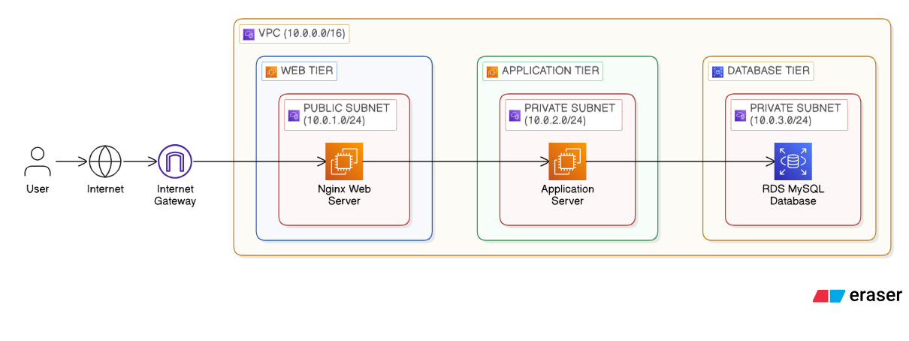
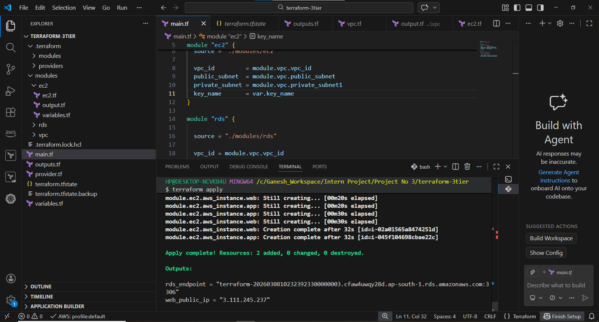
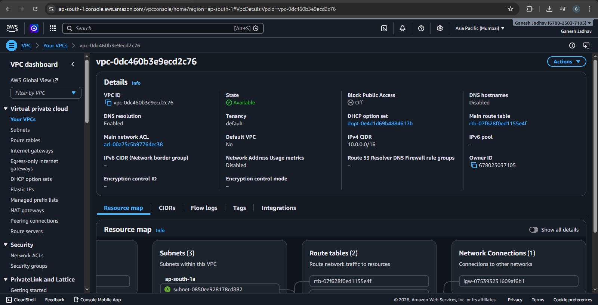
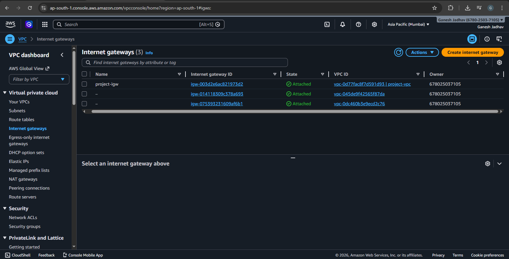
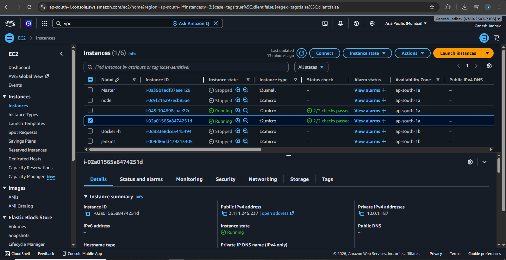
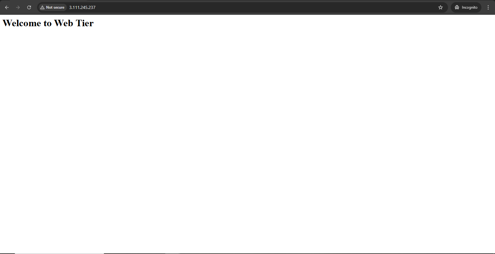
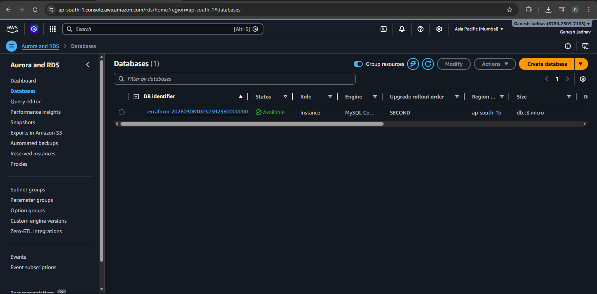
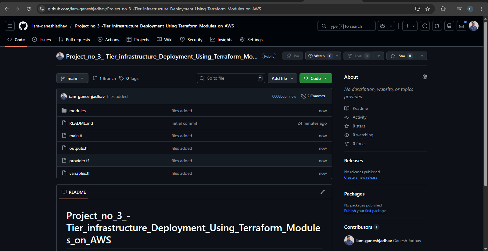

# 3-Tier Infrastructure Deployment Using Terraform Modules on AWS

## Project Overview

This project demonstrates how to deploy a **3-Tier Architecture on AWS using Terraform Modules**.  
The infrastructure is automated using **Terraform (Infrastructure as Code)** and deployed on **Amazon Web Services (AWS)**.

The architecture separates the application into three layers:

1. **Web Tier**
2. **Application Tier**
3. **Database Tier**

This design improves scalability, security, and maintainability.

---

## Architecture

The system follows a **3-tier architecture model**.

User → Internet → Internet Gateway → Web Server → Application Server → Database

### Components

- **VPC (10.0.0.0/16)**
- **Public Subnet**
- **Private Subnet**
- **Internet Gateway**
- **EC2 Instance (Web Server - Nginx)**
- **EC2 Instance (Application Server)**
- **Amazon RDS MySQL Database**

---

## Architecture Diagram



---

## Technologies Used

- **AWS (Amazon Web Services)**
- **Terraform**
- **EC2**
- **VPC**
- **RDS**
- **Nginx**
- **GitHub**

---

## Project Structure
```
terraform-3tier

modules
├── vpc
│ └── vpc.tf
├── ec2
│ └── ec2.tf
└── rds
└── rds.tf
main.tf
provider.tf
variables.tf
outputs.tf
README.md
```

---

## Prerequisites

Before running this project, make sure the following tools are installed:

- AWS CLI
- Terraform
- Git
- AWS Account


## Deployment Steps

### 1 Clone the Repository
```
git clone https://github.com/iam-ganeshjadhav/

Project_no_3_Tier_infrastructure_Deployment_Using_Terraform_Modules_on_AWS.git

cd Project_no_3_Tier_infrastructure_Deployment_Using_Terraform_Modules_on_AWS
```


---

### 2 Initialize Terraform

```
terraform init 
```

This command downloads required Terraform providers.

---

### 3 Check Terraform Plan
```
terraform Plan
```

This shows the resources Terraform will create.

---

### 4 Deploy Infrastructure
```
terraform apply
```


Type **yes** to confirm.

Terraform will create:

- VPC
- Subnets
- Internet Gateway
- EC2 Instances
- RDS Database

---

## Access Web Server

After deployment, Terraform outputs the **public IP of the Web Server**.

Open in browser:
```
http://WEB_PUBLIC_IP
```

You should see:

```
Welcome to Web Tier
```
## Outputs

Terraform provides the following outputs:

| Output | Description |
|------|------|
| web_public_ip | Public IP of Web Server |
| rds_endpoint | RDS Database Endpoint |

---
## Screenshots

| Screenshot | Description | Image |
|------------|-------------|-------|
| Terraform Deployment | Infrastructure created using Terraform apply command |  |
| VPC Configuration | Custom VPC with CIDR block 10.0.0.0/16 created | |
| Internet Gateway | Internet Gateway attached to VPC for internet access |  |
| EC2 Instances | Web and Application EC2 instances running |  |
| Web Server Output | Nginx web page accessed using EC2 public IP |  |
| RDS Database | Amazon RDS MySQL database instance created |  |
| GitHub Repository | Terraform project code stored in GitHub |  |


## Advantages of the Architecture

- Infrastructure automation using Terraform
- Modular code structure
- Secure network design
- Scalable architecture
- Easy cloud deployment

---

## Author

**Ganesh Jadhav**

DevOps & AWS Intern

GitHub:  https://github.com/iam-ganeshjadhav

E-mail: jadhavg9370@gmail.com

Linkedin: https://www.linkedin.com/in/ganesh-jadhav-30813a267/

---

## Conclusion

This project demonstrates how to deploy a **3-Tier AWS Infrastructure using Terraform Modules**.  
The architecture separates the application into different layers, improving security and scalability while following DevOps best practices.

